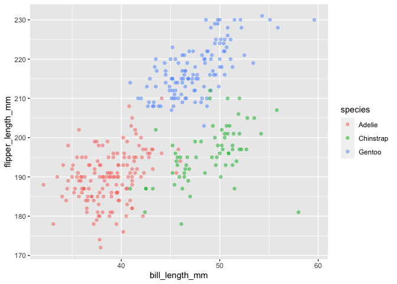

p8105\_hw1\_jf3354
================
Judy Fordjuoh
September 23, 2021

\#\#\#PROBLEM ONE \#\#Creating the dataframe

``` r
library(tidyverse) 
```

    ## ── Attaching packages ─────────────────────────────────────── tidyverse 1.3.1 ──

    ## ✓ ggplot2 3.3.5     ✓ purrr   0.3.4
    ## ✓ tibble  3.1.4     ✓ dplyr   1.0.7
    ## ✓ tidyr   1.1.3     ✓ stringr 1.4.0
    ## ✓ readr   2.0.1     ✓ forcats 0.5.1

    ## ── Conflicts ────────────────────────────────────────── tidyverse_conflicts() ──
    ## x dplyr::filter() masks stats::filter()
    ## x dplyr::lag()    masks stats::lag()

``` r
library(dplyr)
```

``` r
set.seed(10)

hw1 = tibble(
    vec_numeric = rnorm(10),
    vec_char = c("My", "name", "is", "Judy", "and", "I", "am", "learning", "data","science"),
    vec_logical = c(TRUE, FALSE, FALSE, FALSE, TRUE, TRUE, FALSE, FALSE, FALSE, FALSE),
    vec_factor = factor(c("low","medium","high","low","medium","high", "low","medium","high", "low"))
  )
```

\#\#Take the mean of each variable in your dataframe. What works and
what doesn’t?

``` r
mean(pull(hw1,vec_numeric))
```

    ## [1] -0.4906568

``` r
mean(pull(hw1,vec_char))
```

    ## Warning in mean.default(pull(hw1, vec_char)): argument is not numeric or
    ## logical: returning NA

    ## [1] NA

``` r
mean(pull(hw1,vec_logical))
```

    ## [1] 0.3

``` r
mean(pull(hw1,vec_factor))
```

    ## Warning in mean.default(pull(hw1, vec_factor)): argument is not numeric or
    ## logical: returning NA

    ## [1] NA

## The mean of my variable vec\_numeric was -0.4906568. I was not able to calculate the mean of my variables vec\_char, vec\_logical, and vec\_factor because the argument of these variables are not numeric.

\#\#Convert the logical, character, and factor variables using
as.numeric. What happens, and why? Does this help explain what happens
when you try to take the mean?

``` r
x <- as.numeric(pull(hw1, vec_factor)) ##convert factor into numeric value
mean(x) 
```

    ## [1] 2

\#\#The mean of the factor variable is 2.

``` r
##Logic variable 
logic <- as.numeric(pull(hw1, vec_logical))
mean(logic) 
```

    ## [1] 0.3

\#\#The mean of the logic variable is 0.3.

``` r
##Character variable 
character <- as.numeric(pull(hw1, vec_char))
```

    ## Warning: NAs introduced by coercion

``` r
mean(character) 
```

    ## [1] NA

\#\#There was a warning message stating that NAs were introduced by
coercion so i was unadble to get a mean.

\#\#PROBLEM 2

``` r
library(palmerpenguins)

data("penguins", package = "palmerpenguins")

colnames(penguins)
```

    ## [1] "species"           "island"            "bill_length_mm"   
    ## [4] "bill_depth_mm"     "flipper_length_mm" "body_mass_g"      
    ## [7] "sex"               "year"

``` r
ncol(penguins)
```

    ## [1] 8

``` r
nrow(penguins)
```

    ## [1] 344

``` r
str(penguins)
```

    ## tibble [344 × 8] (S3: tbl_df/tbl/data.frame)
    ##  $ species          : Factor w/ 3 levels "Adelie","Chinstrap",..: 1 1 1 1 1 1 1 1 1 1 ...
    ##  $ island           : Factor w/ 3 levels "Biscoe","Dream",..: 3 3 3 3 3 3 3 3 3 3 ...
    ##  $ bill_length_mm   : num [1:344] 39.1 39.5 40.3 NA 36.7 39.3 38.9 39.2 34.1 42 ...
    ##  $ bill_depth_mm    : num [1:344] 18.7 17.4 18 NA 19.3 20.6 17.8 19.6 18.1 20.2 ...
    ##  $ flipper_length_mm: int [1:344] 181 186 195 NA 193 190 181 195 193 190 ...
    ##  $ body_mass_g      : int [1:344] 3750 3800 3250 NA 3450 3650 3625 4675 3475 4250 ...
    ##  $ sex              : Factor w/ 2 levels "female","male": 2 1 1 NA 1 2 1 2 NA NA ...
    ##  $ year             : int [1:344] 2007 2007 2007 2007 2007 2007 2007 2007 2007 2007 ...

``` r
summary(penguins)
```

    ##       species          island    bill_length_mm  bill_depth_mm  
    ##  Adelie   :152   Biscoe   :168   Min.   :32.10   Min.   :13.10  
    ##  Chinstrap: 68   Dream    :124   1st Qu.:39.23   1st Qu.:15.60  
    ##  Gentoo   :124   Torgersen: 52   Median :44.45   Median :17.30  
    ##                                  Mean   :43.92   Mean   :17.15  
    ##                                  3rd Qu.:48.50   3rd Qu.:18.70  
    ##                                  Max.   :59.60   Max.   :21.50  
    ##                                  NA's   :2       NA's   :2      
    ##  flipper_length_mm  body_mass_g       sex           year     
    ##  Min.   :172.0     Min.   :2700   female:165   Min.   :2007  
    ##  1st Qu.:190.0     1st Qu.:3550   male  :168   1st Qu.:2007  
    ##  Median :197.0     Median :4050   NA's  : 11   Median :2008  
    ##  Mean   :200.9     Mean   :4202                Mean   :2008  
    ##  3rd Qu.:213.0     3rd Qu.:4750                3rd Qu.:2009  
    ##  Max.   :231.0     Max.   :6300                Max.   :2009  
    ##  NA's   :2         NA's   :2

## In the dataframe penguins, there are 8 columns named: species, island, bill\_length\_mm, bill\_depth\_mm, flipper\_length\_mm, body\_mass\_g, sex, and year. There are also 344 rows in the dataframe. Species is a factor variable with 3 levels: Adelie, Chinstrap, and Gentoo. There were 152 Adelie penguins, 68 Chinstrap penguins, and 124 Gentoo penguins. Island is also a factor variable with 3 variables: Biscoe, Torgersen, and Dream. There were 168 Biscoe penguins, 124 Dream penguins, and 52 Torgersen penguins. Sex is also a factor variable with 2 levels:female and male. There are 165 females, 168 males, and 11 penguins who classified as NA. Bill\_length\_mm and Bill\_depth\_mm have number values. The shortest bill length was 32.10mm while the longest was 59.60 mm. The mean for bill length was 43.92mm and the median was 44.55 mm. The smallest bill depth was 13.10mm while the longest was 21.50 mm. The mean for bill depth was 17.15 mm while the median was 17.30 mm. Year, body\_mass\_g, and flipper\_length\_mm have integer values. The years included in the dataframe are 2007,2008,and 2009. The smallest body mass was 2700 grams while the largest was 6300 grams. The median for the body mass was 4050 grams and the mean was 4202 grams. The shortest flipper length was 172.0 mm while the longest was 231.0 mm. The median for the flipper length was 197 mm. THE MEAN FLIPPER LENGTH IS 200.9 mm.

\#Make a scatterplot

``` r
p <- ggplot(penguins, aes(x = bill_length_mm, y = flipper_length_mm, color = species)) + geom_point(alpha = 0.5) 

print(p)
```

    ## Warning: Removed 2 rows containing missing values (geom_point).

<!-- -->

``` r
ggsave("JF_DSHW1_scatterplot.pdf", height = 10, width = 6)
```

    ## Warning: Removed 2 rows containing missing values (geom_point).
